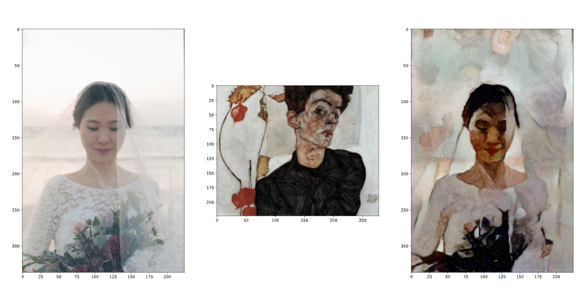

[image1]: ./img/content_style_reconstruction.png "CSR"

# Image Style Transfer Using Convolutional Neural Networks

Changing image style by using CNN features.

<figure>
    
    <figcaption> Content, Style and Style Transfered Image. The content image is HS J's wedding snap photo in JEJU island(2020).<br/> The style image is Egon Schiele's Self-Portrait with Physails(1912).
    <br/> The style transfered image made by using 'A Neural Algorithm of Artistic Style'.</figcaption>
</figure>


## Overview

1. Content and Style Reconstruction by using CNN
2. Style Transfer
3. Reference

## Content and Style Reconstruction by using CNN

19-layer VGG network is used for representing content and style.

#### CNN architecture (VGG19)

```python
net = models.vgg19(pretrained=True).features
```

#### Content reconstruction

```python
contents_recon_layers = {'2':'conv1_2','7':'conv2_2','12':'conv3_2',
                         '21':'conv4_2','30':'conv5_2'}

content_features = get_features(content, net, contents_recon_layers)

for layer in contents_recon_layers:
    print('layer recon : ', contents_recon_layers[layer])
    content_recon = content.clone()
    content_recon[content_recon!=0] = 0
    content_recon = content_recon.requires_grad_(True).to(device)
    steps = 4000

    optimizer = optim.Adam([content_recon], lr=0.001)

    for i in range(1, steps+1):
        content_recon_features = get_features(content_recon, net, contents_recon_layers)
        content_loss = torch.mean((content_recon_features[contents_recon_layers[layer]] - content_features[contents_recon_layers[layer]])**2);
        
        optimizer.zero_grad()
        content_loss.backward()
        optimizer.step()

    print('content recon loss: ', content_loss.item())
    plt.figure(figsize=(15, 15))
    plt.imshow(image_convert(content_recon))
    plt.show()
```

#### Style reconstruction

```python
style_recon_layers = ['conv1_1', 'conv2_1', 'conv3_1', 'conv4_1', 'conv5_1']
style_recon_layers_arr = {'0': 'conv1_1', '5': 'conv2_1', '10': 'conv3_1','19': 'conv4_1', '28': 'conv5_1'}
style_recon_grams = {layer: gram_matrix(style_features[layer]) for layer in style_features}

for l in range(0, len(style_recon_layers)):
    print('layer recon : ', style_recon_layers[l])
    style_recon = style.clone()
    style_recon[style_recon!=0] = 0
    style_recon = style_recon.requires_grad_(True).to(device)
    steps = 4000

    optimizer = optim.Adam([style_recon], lr=0.001)

    for i in range(1, steps+1):
        style_recon_features = get_features(style_recon, net, style_recon_layers_arr)
        style_total_loss = 0;

        for c in range(0, l+1):
            style_recon_feature = style_recon_features[style_recon_layers[c]]
            _, d, h, w = style_recon_feature.shape

            style_recon_gram = gram_matrix(style_recon_feature)
            style_loss = torch.mean((style_recon_gram - style_recon_grams[style_recon_layers[c]])**2)
            style_total_loss += style_loss / (d * h * w)

        optimizer.zero_grad()
        style_total_loss.backward()
        optimizer.step()

    print('style recon loss: ', style_total_loss.item())
    plt.figure(figsize=(15, 15))
    plt.imshow(image_convert(style_recon))
    plt.show()
```

#### Content and Style reconstruction result

![Content & Style Reconstruction][image1]

## Style Transfer

```python
content_weight = 1 # alpha
style_weight = 1e3 # beta

for i in range(1, steps+1):
    target_features = get_features(target, net, layers)
    content_loss = torch.mean((target_features['conv4_2'] - content_features['conv4_2'])**2)

    style_loss = 0

    for layer in style_weights:
        _, d, h, w = target_features[layer].shape

        target_gram = gram_matrix(target_features[layer])
        layer_style_loss = style_weights[layer] * torch.mean((target_gram - style_grams[layer])**2)
        style_loss += layer_style_loss / (d * h * w)

    # total loss
    total_loss = content_weight * content_loss + style_weight * style_loss

    optimizer.zero_grad()
    total_loss.backward()
    optimizer.step()

    if i % show_every == 0:
        print('Total loss: ', total_loss.item())
        plt.figure(figsize=(15, 15))
        plt.imshow(image_convert(target))
        plt.show()
```


## Reference

* [Image Style Transfer Using Convolutional Neural Networks](https://www.cv-foundation.org/openaccess/content_cvpr_2016/papers/Gatys_Image_Style_Transfer_CVPR_2016_paper.pdf) by Leon A. Gatys et al
