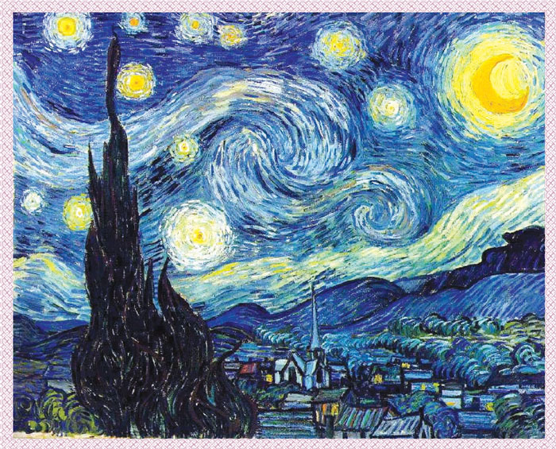

[image1]: ./img/result1.PNG "Style Transfer Result"
[image2]: ./img/VGG19_VGGCNN.PNG "VGG19"

# Image Style Transfer Using Convolutional Neural Networks

Changing image style by using CNN features.

![Style Transfer Result][image1]

## Overview

1. Load content and style images
2. Extracting content and style features by using VGG19 layers
3. Updating the target and calculating losses
4. Display the target image


## Load Content and Style Image 

<figure>
    
    
    <figcaption> Content & Style Image</figcaption>
</figure>

```python
def load_image(img_path, max_size=400, shape=None):
    """Load image (max size <= 400)"""
    image = Image.open(img_path).convert('RGB')
    
    if max(image.size) > max_size:
        size = max_size
    else:
        size = max(image.size)
    
    if shape is not None:
        size = shape
        
    in_transform = transforms.Compose([
                        transforms.Resize(size),
                        transforms.ToTensor(),
                        transforms.Normalize((0.485, 0.456, 0.406), 
                                             (0.229, 0.224, 0.225))])

    # discard alpha channel
    image = in_transform(image)[:3,:,:].unsqueeze(0)
    
    return image
```

## Extracting content and style features by using VGG19 layers

#### VGG19 

![VGG19][image2]


#### Calculate Gram Matrix

```python
def gram_matrix(tensor):
    """ Calculate the Gram Matrix of a given tensor"""
    # get the batch_size, depth, height, and width of the Tensor
    _, d, h, w = tensor.size()
    
    # calculate the gram matrix
    tensor = tensor.view(d, h * w)
    gram = torch.mm(tensor, tensor.t())
    
    return gram
```

## Updating the target and calculating losses


## Display the target image


